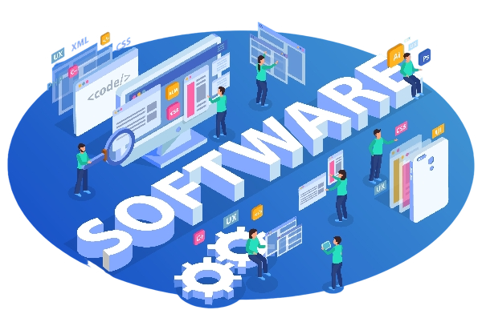

<h1 align="center">Hi 👋, I'm Aishani Goyal</h1>
<h3 align="center">BTech CSE'26 Undergrad | Aspiring Software Development Engineer</h3>
 

- 🔭 I am currently working on an "AI-driven archaeological site mapping" project as an AI Intern at Infosys Springboard.

- 🌱 Recently completed a Gen-AI project named "Fake News Detector and Generator" as part of IBM PBEL (Project-Based Experiential Learning) program.

- 📫 How to reach me: **aishanigoyal2005@gmail.com**

<h3 align="left">Connect with me:</h3>

### Languages and Tools:

**Languages:** Java, C, Python, HTML, CSS, JavaScript, SQL

**Frameworks:** Bootstrap, React.js, Node.js, Express.js

**Tools:** Git, Postman, Figma

**Databases:** MySQL , MongoDB, Cloud Firestore
